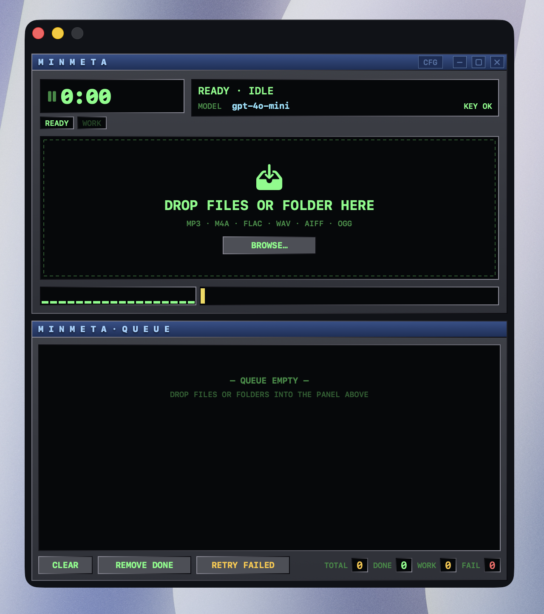

# Minmeta

A native macOS app that fills in missing ID3 / iTunes metadata for your music
library by asking an OpenAI-compatible model to identify each track from its
filename, folder layout, and any tags already on disk. Cover art is fetched
from the free iTunes Search API and embedded into the file.

<p align="center">
  
</p>

## What it does

Drop one file or a whole folder onto Minmeta. For each track it:

1. Reads existing tags + technical info via AVFoundation.
2. Sends the filename, parent folder names, and existing tags to your
   configured OpenAI-compatible endpoint and asks for canonical metadata.
3. Looks up cover art on the iTunes Search API and downloads a 600×600 JPEG.
4. Writes the result back into the file.

### Fields

- **Essential** — title, artist, album, album artist, year, genre, track
- **Extended** — composer, copyright, embedded album art (front cover)
- **Lyrics** — the writers support unsynchronized-lyrics frames (USLT for MP3,
  iTunes lyrics atom for M4A) but the AI prompt does not request lyrics; wire
  in your own source if you want them populated.
- **Technical** (read-only, shown as chips, never written) — bitrate,
  sample rate, duration, channels, codec.

### Formats

| Format          | Read | Write                                                                     |
|-----------------|------|---------------------------------------------------------------------------|
| MP3             |  ✓   | ✓ ID3v2.3 — TIT2 TPE1 TALB TPE2 TYER TCON TRCK TCOM TCOP USLT APIC        |
| M4A / MP4 / AAC |  ✓   | ✓ via `AVAssetExportSession` passthrough + atomic replace                  |
| FLAC / WAV / AIFF / OGG | ✓ | — marked `SKIPPED`; AI suggestion is still shown in the queue row     |

## Build

Requires macOS 13+ and the Swift toolchain that ships with Xcode 15+.

```bash
./build.sh
open build/Minmeta.app
```

The script regenerates `App/AppIcon.icns` if `App/icon-source.png` is newer,
then runs `swift build -c release` and produces an ad-hoc-signed
`build/Minmeta.app`.

## Usage

1. **Lock screen** — paste your OpenAI-compatible API key. Optionally change
   the base URL (default `https://api.openai.com/v1`) and model
   (default `gpt-4o-mini`). Minmeta hits `GET /models` to verify the key
   before unlocking.
2. **Drop files / folders** onto the dropzone, or click `BROWSE…`. Folders
   are walked recursively for supported extensions.
3. Each row goes through the phases **WAIT → READ → AI → ART → TAG → DONE**.
   The LED pulses through a phase-coloured palette (green / cyan / yellow /
   amber), the elapsed counter ticks live, and a per-row progress bar
   shimmers during the long phases. 3 files run in parallel.
4. **Buttons** — `CLEAR` empties the queue (keeps in-flight items),
   `REMOVE DONE` purges completed/skipped rows, `RETRY FAILED` re-queues
   anything that errored, `CFG` in the title bar opens an inline settings
   drawer to change key / base URL / model without leaving the main view.

## Privacy

- The API key is stored at
  `~/Library/Application Support/Minmeta/credentials.json` (mode 0600,
  owner-only). The macOS Keychain is not used: every ad-hoc rebuild has a
  different code signature, which would prompt the "Allow / Always Allow"
  dialog on each launch.
- The filename, parent folder names, and existing tag values for each track
  are sent to the base URL you configure. **Audio bytes never leave the
  machine.**
- Album art is fetched from `https://itunes.apple.com/search` (no key,
  Apple's free public endpoint) and embedded locally.
- Diagnostic events go to `OSLog`, subsystem `id.moerdowo.minmeta`. View
  them with:
  ```bash
  log show --predicate 'subsystem == "id.moerdowo.minmeta"' --style compact --last 5m
  ```

## Layout

```
Sources/Minmeta/
├── MinmetaApp.swift              # @main + RootView lock/main switch
├── AppState.swift                # ObservableObject, queue, models
├── Theme.swift                   # Winamp colour palette + bevel modifiers
├── Views/
│   ├── Panel.swift               # reusable Winamp-style panel chrome
│   ├── LockScreenView.swift      # API-key entry + verification
│   ├── MainScreenView.swift      # drop zone + status + activity meter
│   └── QueuePanelView.swift      # playlist-style queue with live updates
└── Services/
    ├── CredentialsStore.swift    # 0600 JSON file in Application Support
    ├── MetadataReader.swift      # AVFoundation tag + tech-info read
    ├── OpenAIClient.swift        # /chat/completions JSON-mode prompt
    ├── ITunesArtClient.swift     # iTunes Search → 600×600 JPEG
    ├── ID3Writer.swift           # ID3v2.3 frame writer (incl. APIC, USLT)
    ├── M4AWriter.swift           # AVAssetExportSession passthrough
    └── ProcessingEngine.swift    # worker pool + phase tracking
Tools/
└── make_icon.swift               # source PNG → AppIcon.iconset (squircle)
```

## Notes

- Style inspiration: classic Winamp 2.x — title bars with control dots, LCD
  green-on-black readouts, beveled buttons, monospaced pixel text. The icon
  shape is a 22.37 % rounded-rect (close enough to Apple's continuous-corner
  squircle that it's indistinguishable at icon resolutions).
- Concurrency is a worker-pool of 3 tasks. `processOne` has a `defer` rescue
  that forces any item still in `.processing` after the function returns to
  `.failed` with a self-explanatory note — the queue never gets visually
  stuck.
- Unsupported containers (FLAC / WAV / OGG) are intentionally `SKIPPED`, not
  `FAILED`; the AI suggestion is still surfaced in the row's detail line for
  reference.
